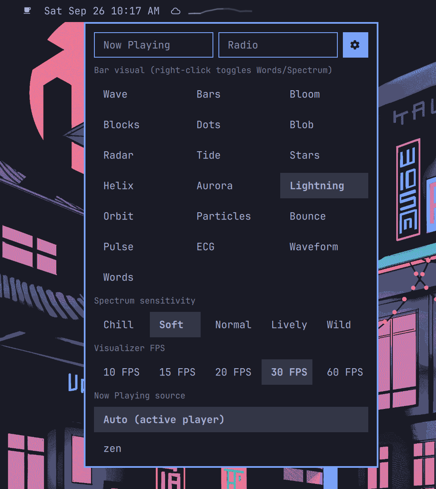
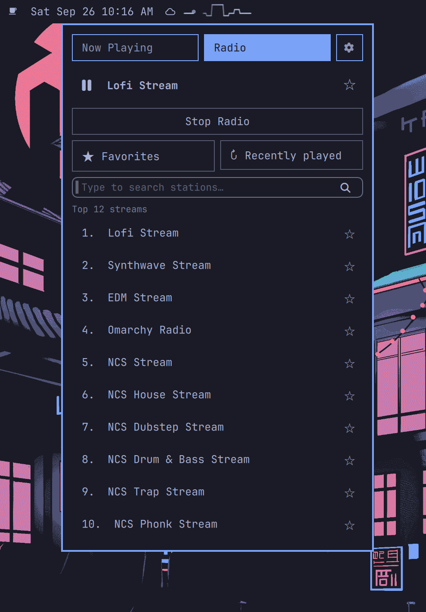
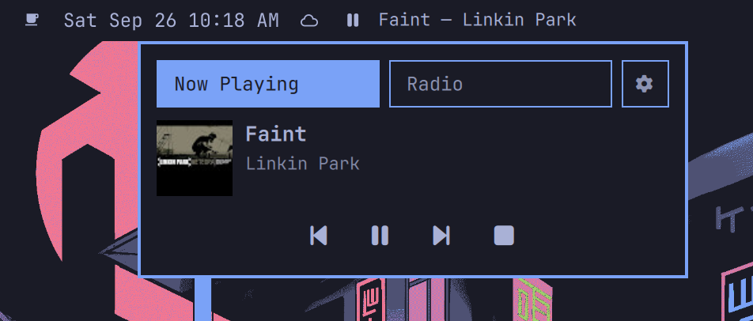

# Resonance — spectrum bar widget + player popup

Live cava spectrum in the Omarchy bar. The strip is a stock
`WidgetButton`, so hover tooltip, pointing-hand cursor, and click routing
behave exactly like the built-in widgets. Hover shows the playing track in a
pill below the bar (title — artist). Left-click opens a three-tab popup,
right-click toggles Words/Spectrum.





- **Now Playing**: any MPRIS player, tracked directly (no dependency on the
  stock `omarchy.media` service) — cover art, title, artist, Prev/Play/Next/
  Stop, all capability-gated. Auto follows whichever player is active; the
  gear tab locks a specific app (Firefox/Zen, Chromium/Chrome, Brave,
  Vivaldi, Opera, VLC, Spotify, mpv and more are always listed, anything else
  appears while running, offline picks are kept). cliamp has its own tab and
  never pollutes this one. Opens by default when something plays.
- **cliamp**: now-playing header with play/pause toggle; curated top-12
  streams (direct `radio.cliamp.stream` URLs via `track.play` — no search
  round-trip, so entries always resolve); search covers names and countries
  with most-listened-first ranking; lists scroll on overflow; cold-start
  buttons when the daemon is down. Opens by default when nothing plays.
- **Settings (gear)**: all 18 bar visuals in a grid plus the music-player
  picker. Both persist to `~/.config/omarchy/mystaryo.media.json`.
- Popup closes via outside-click (scrim) or **Esc**.

## Bar visuals (18)

Wave (default), Bars, Bloom, Blocks, Dots, Blob, Radar, Tide, Stars, Helix,
Aurora, Lightning, Orbit, Particles, Bounce, Pulse, ECG, Waveform. 
Pick in the gear tab; right-click toggles Words/Spectrum.

## Files

- `manifest.json` — plugin manifest (`mystaryo.media`, `bar-widget`).
- `MediaWidget.qml` — bar strip, popup, MPRIS tracking, cliamp IPC.
- `Visualizer.qml` — canvas painters for the 18 styles (graceful `paintWave`
  fallback on any paint error, so a bad frame can never crash the bar).
- `cava.conf` — portable cava config, no user paths, no `~/.config/cava`
  dependency.

## Requires (all degrade gracefully if missing)

- `cava` (`omarchy pkg add cava`) + `parecord`/`pactl` (libpulse,
  preinstalled): audio arrives via a low-latency `parecord` bridge (default
  sink monitor, raw s16le, 50ms latency) into a fifo that cava reads at
  the selected visualizer FPS (30 by default) — cava 0.10.x's native
  PipeWire/Pulse inputs attach but read zeros
  on this system. The wrapper reaps stale fifo writers on startup, so
  hot-reloads can't stack duplicate recorders. Without them, the bar shows
  a static ♪.
- `cliamp` daemon (`cliamp -d`, auto-started from the cliamp tab) — without
  it, the widget is pure-MPRIS (spectrum + transport for any player).

## Design rules

- MPRIS + audio-tap data only. No notification listeners: unknown sounds
  can only move bars, never crash anything.
- Every external boundary degrades: dead cava restarts with backoff (5 tries,
  then static ♪); missing players fall back to Auto; junk metadata gets
  `"Unknown …"` fallbacks; capability-gated buttons; debug logging behind
  a `debug` flag (default off).
- Colors come from the live bar theme. No absolute paths, no hardcoded
  home directory.

## Install

```bash
omarchy plugin add https://github.com/ShravyaKudlu/omarchy-plugin-resonance --enable
omarchy bar put mystaryo.media --section left
omarchy restart shell
```

## Rollback

`omarchy plugin disable mystaryo.media`
